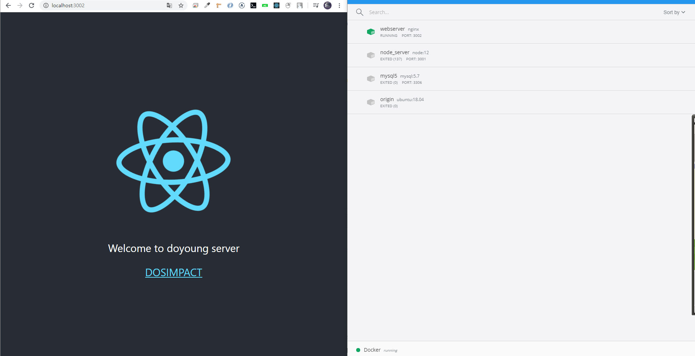
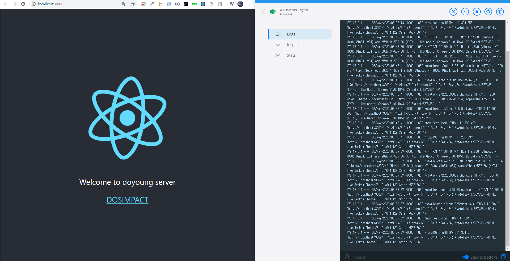

# react build > docker nginx webserver




# 1. react build

```js
nginx 이미지에는 node가 없으므로 build 환경이 안된다. 불편하지만, build파일을 깃허브에 올리고, 클론하는 방법을 쓰자.

.gitignore /build 제외

yarn start
yarn build
git push origin master

```

# docker

```js
docker pull nginx
docker run -it -p 3002:80 --name webserver nginx
docker exec -it webserver bash
```

# in nginx container

```js
apt-get update
apt-get install -y vim # 설정파일 변경
apt-get install -y git # 깃 클론을 위해

// 클론

mkdir /var/www/
cd /var/www/
git clone origin <your-repo>
cp <reponame>/build ./

// nginx 설정 - index.html 위치

cd /etc/nginx
cd ./conf.d/
root@ccf372b70d8d:/etc/nginx/conf.d# cat default.conf
server {
    listen       80;
    server_name  localhost;

    #charset koi8-r;
    #access_log  /var/log/nginx/host.access.log  main;

    location / {
        root   /var/www/build/;
        index  index.html index.htm;
    }
    ...
```
